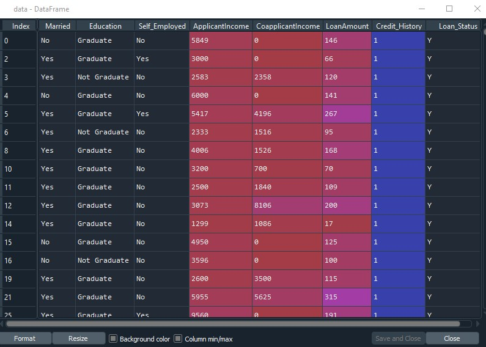
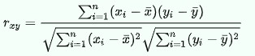
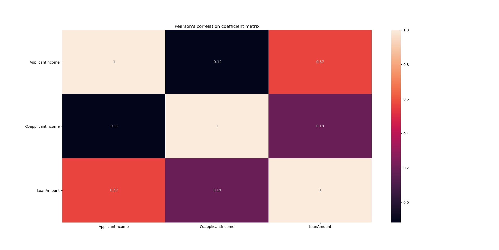
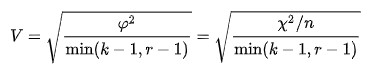
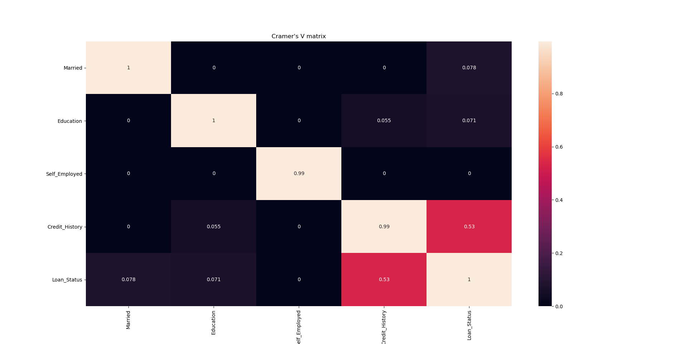
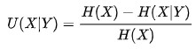
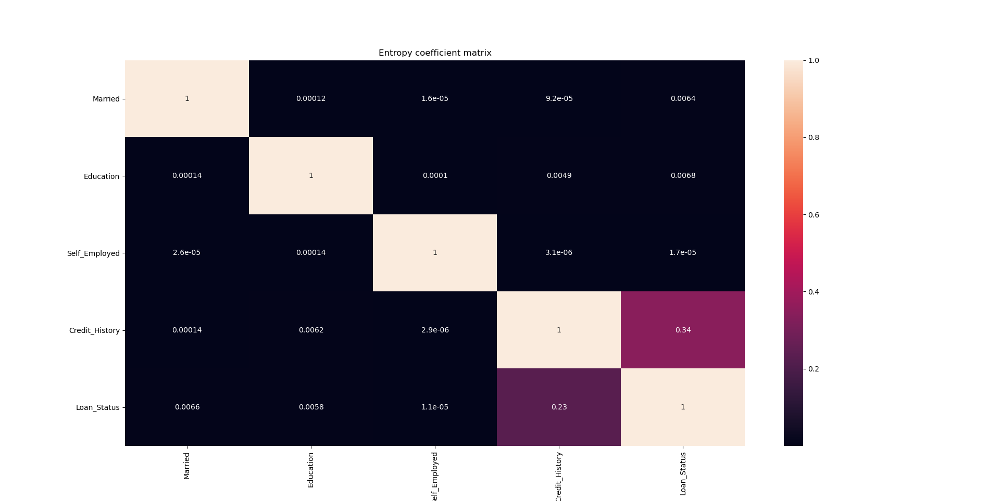
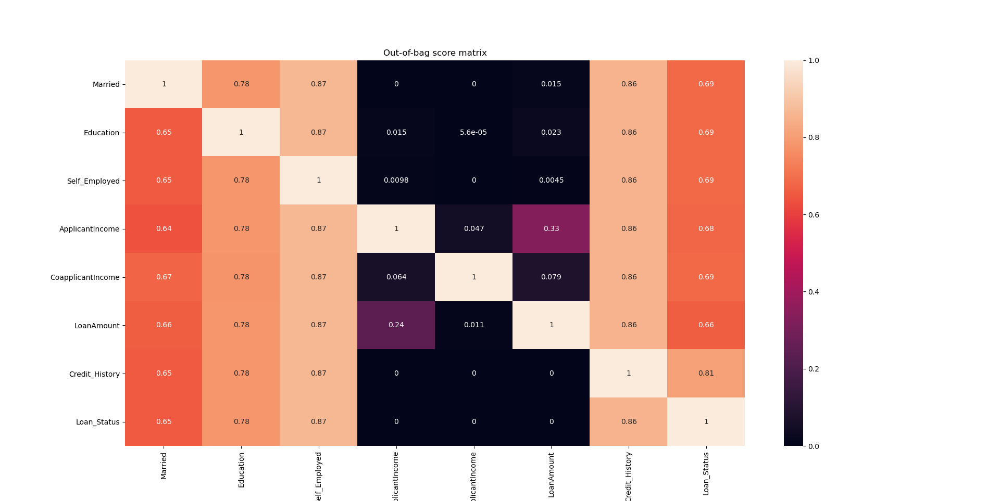

# FeatureSelector: Automatically computing correlations and associations metrics
**FeatureSelector** is a library useful to check whether two distributions are correlated or associated. Variables types are **automatically detected**(categorical and numerical)

## Four metrics available:
  The following metrics have been calculated on this dataset:
  
   
  
  - **Pearson's correlation coefficient:** Correlations between numerical variables
  
  
  
 
  - **Cramer's V**: Cramer's V between categorical variables
  
  
  
  
  - **Theil's U/Entropy coefficient/Uncertainty coefficient**: Assymetric metric calculated for pairs of categorical variables
  
  
  
  
  - **Out-of-bag score**: Assymetric metric computed with a random forest. It is useful to detect both linear and non-linear relationships between all kind of variables
  
  

## Coding example:
```python
from pandas import read_csv
from os.path import join
from VariableSelection.feature_selector import FeatureSelector
"""
############################################
############  MAIN OBJECT  ################
############################################
"""
data = read_csv(join("data", "loan_approval.csv")) 
feature_selector = FeatureSelector(data)

"""
############################################
############ DATA RETRIEVAL  ###############
############################################
"""
entropy_coef_matrix = feature_selector.get_entropy_coef_matrix()
cramer_v_matrix = feature_selector.get_cramer_v_matrix()
corr_coef_matrix = feature_selector.get_corr_coef_matrix()
oob_matrix = feature_selector.get_oob_score_matrix(n_estimators=100, 
                                                   additional_estimators=100, 
                                                   min_samples_split=30)
"""
############################################
############ MATRICES DISPLAY  #############
############################################
"""
feature_selector.show_matrix_graph(corr_coef_matrix, "Corr coef matrix")
feature_selector.show_matrix_graph(cramer_v_matrix, "Cramer's v matrix")
feature_selector.show_matrix_graph(entropy_coef_matrix, "Entropy coef_matrix")
feature_selector.show_matrix_graph(oob_matrix, "Out of bag error matrix")
```
## Reference:
  Wikipedia
